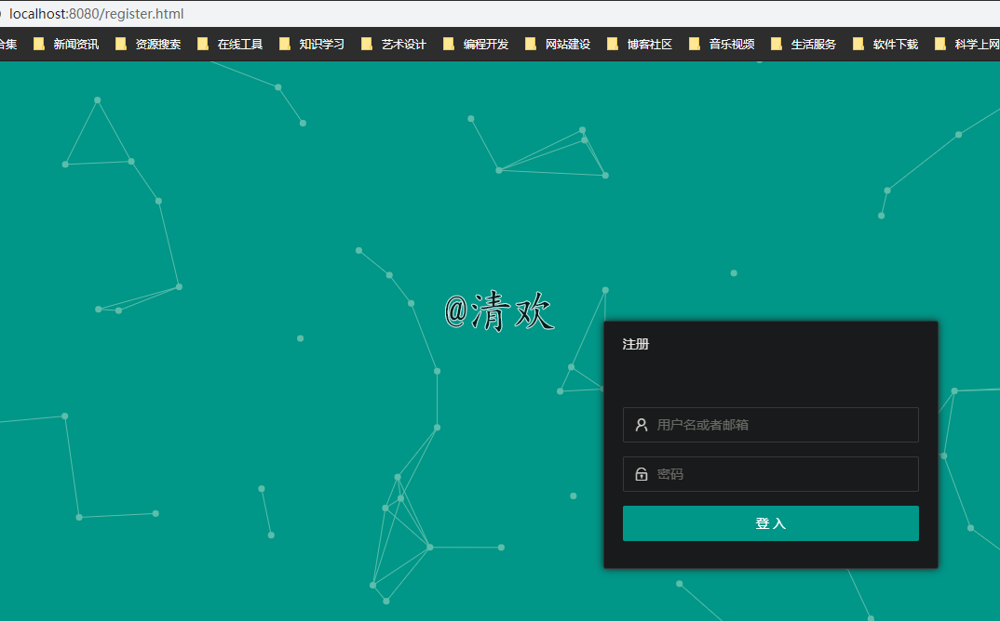
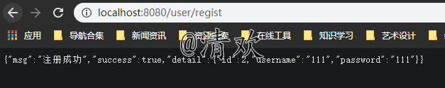
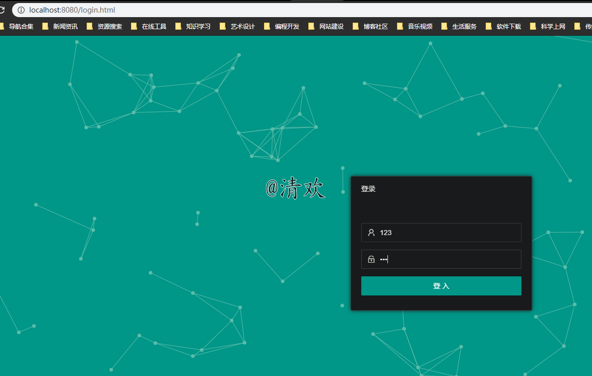
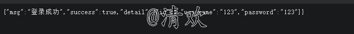

# 项目说明
浙江中亿 springboot 简单注册登录。

项目地址：

# 需求分析

......

# 项目构架
因为任何要求，所以采用最简单的html。完成简单的增删查改。
- spring.boot 1.5
- mysql5.6
- jdk 1.8
- layuimini

# 项目部署
- idea 导入项目
- mysql导入login.sql
- ap.yml更改数据库密码
- 运行Application

# 项目演示
运行成功后 打开http://localhost:8080/regist.html

## 注册

输入测试数据

显示注册成功

## 登录

http://localhost:8080/login.html

